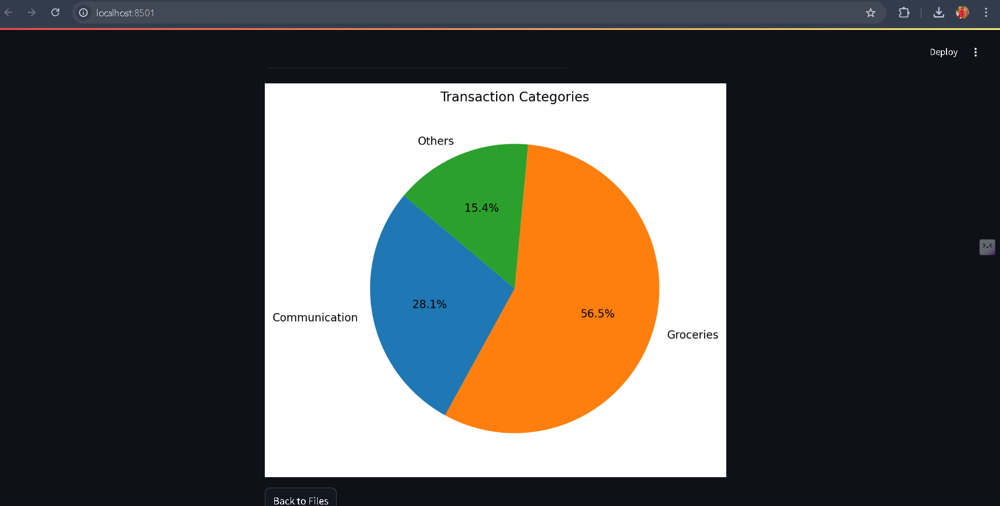

# BFSI OCR Project

## Description
The **BFSI OCR Project** is designed to automate the extraction of textual data from banking, financial services, and insurance (BFSI) documents and categorizing the data. This project leverages Optical Character Recognition (OCR) techniques to process documents such as bank statements, invoices, cheques, and legal forms. The extracted text is further refined through image preprocessing and post-processing steps to enhance accuracy.

## Screenshots





## Technology Stack
- **Programming Languages:** Python
- **OCR Tools:** Tesseract OCR.
- **Libraries:** Pytesseract, os, subprocess, streamlit.
- **Data Handling:** APIs, Web Scraping
- **Data base:** Mangodb

## Necessary Installations
...
 Install the dependencies mentioned in requirements.txt
```

Additionally, ensure **Tesseract OCR** is installed:
- Download and install [Tesseract OCR](https://github.com/tesseract-ocr/tesseract)
- Add Tesseract to your system’s PATH

## Issues Faced
- **Low OCR Accuracy:** Resolved using adaptive thresholding and noise reduction.
- **Distorted Document Layouts:** Handled with contour detection and alignment.
- **Language Model Errors:** Used NLP-based post-processing for context-aware corrections.

## Connect Me On...
- **LinkedIn:** [Katkuri balram](https://www.linkedin.com/in/katkuri-balram-143284248/)
- **GitHub:** [Balram](https://github.com/katkuriBalram)
- **Email:** Katkuribalram@gmail.com

## Open to Further Advancements
This project can be improved with:
- **Deep Learning Models:** Integrating Transformer-based OCR models like Donut or TrOCR.
- **Cloud-based OCR APIs:** Using AWS Textract, Azure OCR, or Google Vision API for enhanced recognition.
- **Multilingual Support:** Expanding OCR capabilities to support multiple languages.

Feel free to contribute or suggest improvements! 🚀
